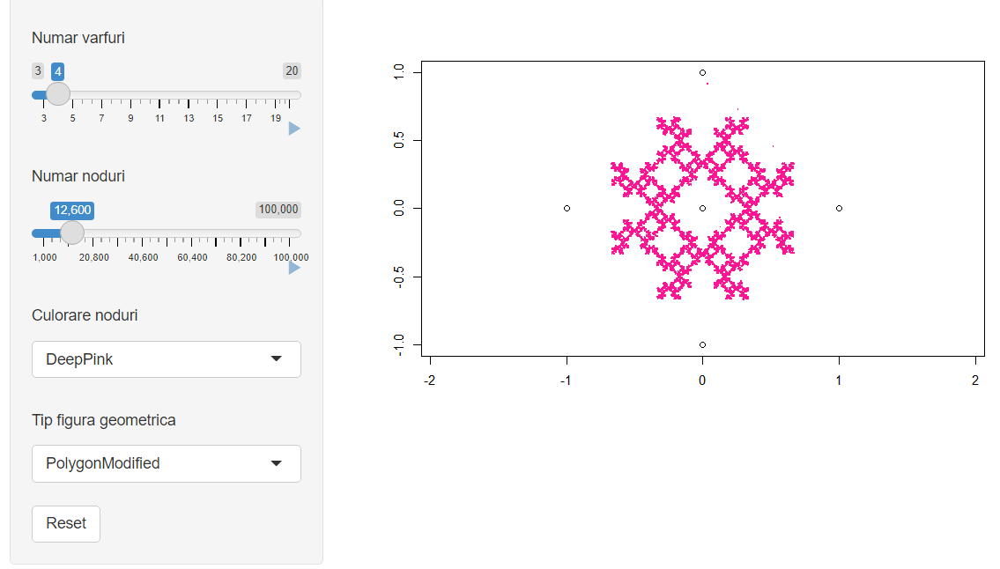
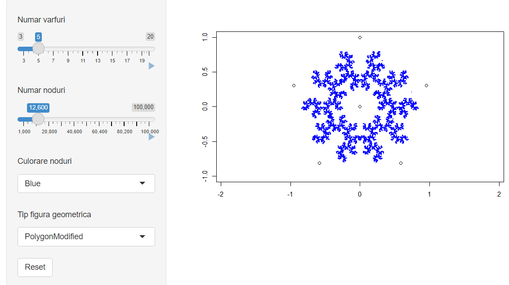
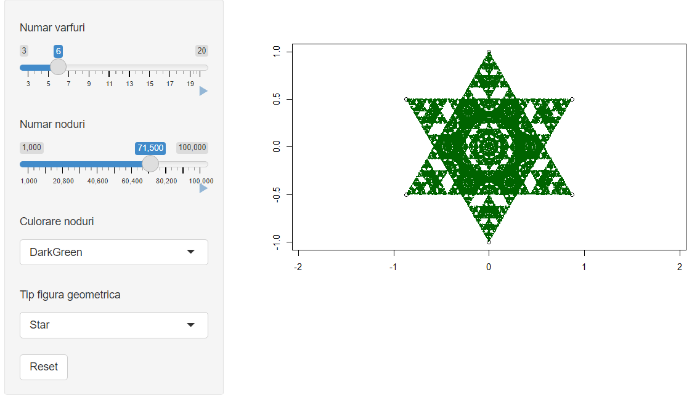
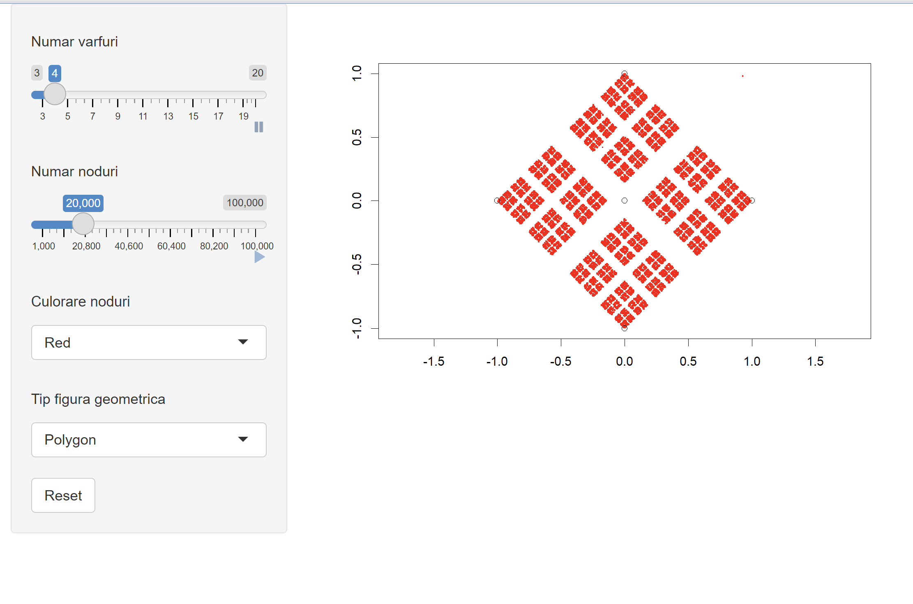
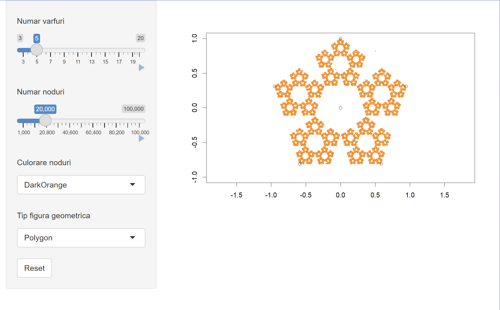

# Chaos-Game-R

  
<h2>Examples of generated shapes</h2>

  

    
Shape 1

    </img>
  

  

    
Shape 2

    </img>
  

  

    
Shape 3

    </img>
  

  

    
Shape 4

    </img>
  

  

    
Shape 5

    </img>
  

